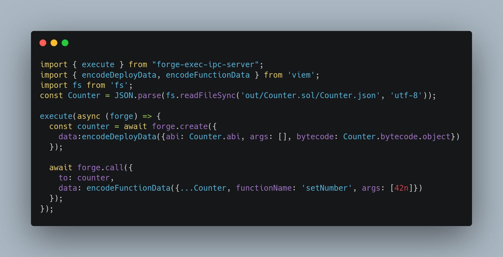

# <h1 align="center"> forge-exec </h1>

**Execute programs from forge with an open 2-way communication channel between both**



## Installation

Install `forge-exec` as git submodules in your foundry project.

```bash
forge install wighawag/forge-exec
```

Install `forge-exec-ipc-client` on your machine, see [release files](https://github.com/wighawag/forge-exec/releases/tag/forge-exec-ipc-client-v0.1.0)

This need to be in your `PATH`

You can also easily install it from source using cargo:

```bash
cargo install forge-exec-ipc-client
```

This command line tool allows `forge-exec` to maintain a 2-way commincation channel with the program being executed.

Tnis means the program is able to send request to forge (create, call, send, ...) and get responses and this until the program wish to stop.

## Usage

1. Add this import to your script or test:

```solidity
import {Exec} from "forge-exec/Exec.sol";
```

1. Execute an external program:

```solidity
string[] memory args = new string[](1);
args[0] = "example.js";
bytes memory result = Exec.execute("node", args);
```

1. You must enable [ffi](https://book.getfoundry.sh/cheatcodes/ffi.html) in order to use the library. You can either pass the `--ffi` flag to any forge commands you run (e.g. `forge script Script --ffi`), or you can add `ffi = true` to your `foundry.toml` file.

> Note The program executed need to create an IPC server to communicate back with forge, see how it works in [forge-exec-ipc-client's README.md](./forge-exec-ipc-client/README.md).
>
> You can use the npm package `forge-exec-ipc-server` for that. See [repo](https://github.com/wighawag/forge-exec-ipc-server-js)

## Javascript Setup

Setup your js project with npm

```bash
npm init
```

Then install `forge-exec-ipc-server` package which will let the script to communicate back with forge

```bash
npm i -D forge-exec-ipc-server
```

Let's also add [viem](https://viem.sh)

```bash
npm i -D viem
```

Now you can write your js script this way

```js
// @ts-check
import { execute } from "forge-exec-ipc-server";
import { encodeDeployData, encodeFunctionData } from 'viem';

import fs from 'fs';
const Counter = JSON.parse(fs.readFileSync('out/Counter.sol/Counter.json', 'utf-8'));

execute(async (forge) => {

  // here we are create a new contract
  // the list of function the forge provider support is the following:
  // call, static_call, create, create2, balance, code, code_hash, code_size, block_hash, block_timestamp, block_number, chainid, send
  const counter = await forge.create({
    data:encodeDeployData({abi: Counter.abi, args: [], bytecode: Counter.bytecode.object})
  });

  // here we make a call from a specified account
  await forge.call({
    from: "0xf39fd6e51aad88f6f4ce6ab8827279cfffb92266",
    to: counter,
    data: encodeFunctionData({...Counter, functionName: 'setNumber', args: [42n]})
  });

  // forge-exec also support return value
  // this is how forge-exec-ipc-server handle them, using viem abiEncode 
  return {
    types: [{
      type: "address",
    }],
    values: [counter],
  };
});
```

### Example

## Javascript

See the [demo repo](https://github.com/wighawag/forge-exec-demo)

`forge-exec` comes as an npm package to and it contains a utility to ensure the `forge-exec-ipc-client` binary is in the path.

1. install `forge-exec`

  ```bash
  npm i -D forge-exec
  ```

2. add `forge-exec-prepare` to your prepare script

  ```json
  {
    "name":  "your-package-name",
    "dependencies": {
      "forge-exec": "^0.1.12"
    },
    "scripts": {
      "prepare": "forge-exec-prepare",
      "test": "forge test"
    }
  }
  ```

This way any npm script like `test` in the package json above, will have `forge-exec-ipc-client` in its PATH

## Rust

`forge-exec` is agnostic to what program you execute, you just need to follow the ipc communication protocol. you can find a very basic rust example in the [demo-rust folder](./demo-rust/)


## Quick Start

```bash
mkdir my-forge-exec-project;
cd my-forge-exec-project;
forge init;

forge install wighawag/forge-exec;

cat >> .gitignore <<EOF

node_modules/
.ipc.log
EOF

cat >> foundry.toml <<EOF

ffi=true
EOF

cat > package.json <<EOF
{
  "name": "forge-exec-demo",
  "private": true,
  "type": "module",
  "devDependencies": {
    "forge-exec-ipc-server": "0.1.12",
    "viem": "^0.3.14"
  },
  "scripts": {
    "execute": "forge script script/Counter.s.sol -vvvvv",
    "test": "forge test"
  }
}
EOF

# install dependencies
pnpm i

cat > example.js <<EOF
// @ts-check
import { execute } from "forge-exec-ipc-server";
import { encodeDeployData, encodeFunctionData } from 'viem';

import fs from 'fs';
const Counter = JSON.parse(fs.readFileSync('out/Counter.sol/Counter.json', 'utf-8'));

execute(async (forge) => {
  const counter = await forge.create({
    data:encodeDeployData({abi: Counter.abi, args: [], bytecode: Counter.bytecode.object})
  });

  await forge.call({
    from: "0xf39fd6e51aad88f6f4ce6ab8827279cfffb92266",
    to: counter,
    data: encodeFunctionData({...Counter, functionName: 'setNumber', args: [42n]})
  });

  return {
    types: [{
      type: "address",
    }],
    values: [counter],
  };
});
EOF

# An example test
cat > test/Counter.t.sol <<EOF
// SPDX-License-Identifier: UNLICENSED
pragma solidity ^0.8.13;

import "forge-std/Test.sol";
import "../src/Counter.sol";
import "forge-exec/src/Exec.sol";

contract CounterTest is Test {
    Counter public counter;
    function setUp() public {
        string[] memory args = new string[](1);
        args[0] = "example.js";
        bytes memory returnData = Exec.execute("node", args);
        counter = abi.decode(returnData,(Counter));
    }

    function testIncrement() public {
        counter.increment();
        assertEq(counter.number(), 43);
    }

    function testSetNumber(uint256 x) public {
        counter.setNumber(x);
        assertEq(counter.number(), x);
    }
}
EOF

# An example script
cat > script/Counter.s.sol <<EOF
// SPDX-License-Identifier: UNLICENSED
pragma solidity ^0.8.13;

import "forge-std/Script.sol";
import {Exec} from "forge-exec/src/Exec.sol";

contract CounterScript is Script {
    function setUp() public {}

    function run() public {
        string[] memory args = new string[](1);
        args[0] = "example.js";
        Exec.execute("node", args);
    }
}
EOF

# we ensure forge-exec-ipc-client is in the path
# you can install it as mentioned in the README
# or simply download them from github. (not that this will not put them in your PATH)
bash lib/forge-exec/forge-exec-ipc-client/bin/download.sh

# in test
PATH=lib/forge-exec/forge-exec-ipc-client/bin:$PATH pnpm test

# in script
PATH=lib/forge-exec/forge-exec-ipc-client/bin:$PATH pnpm execute
```
